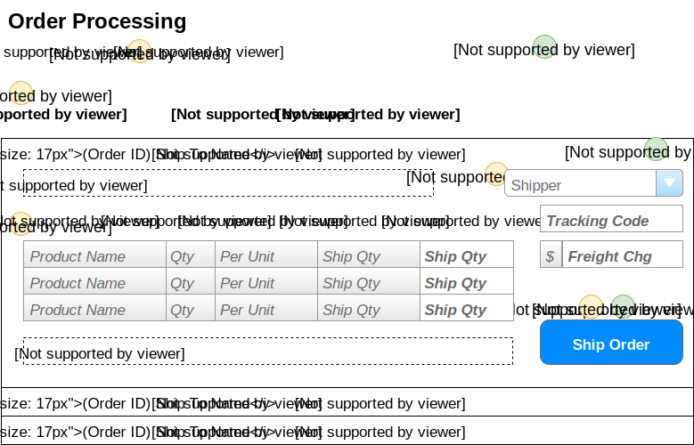

# Order Processing

> Orders are shipped directly from our suppliers to our customers. As such, suppliers log onto our system to see what orders there are for the products that they provide.

## User Interface

Suppliers will be interacting with a page that shows the following information.


### Events and Interactions

-  - **Page_Load** event
    -  - Supplier/Contact names obtained from who the logged-in user is.
    -  - Load the ListView data
        - **`List<OutstandingOrder>OrderProcessingController.LoadOrders(SupplierID)`**
    -  - Load the list of shippers
        - **`List<ShipperSelection>OrderProcessingController.ListShippers()`**
-  - **EditCommand** click event
    - Default EditCommand behaviour of the ListView
    - `<EditItemTemplate>` will display the extended information of the Products List  and other order information.
-  - **ShipOrder** click
    - Use a custom command name of "ShipOrder" and handle in the ListView's ItemCommand event.
    - Gather information from the form for the products to be shipped and the shipping information. This is sent to the **``void OrderProcessingController.ShipOrder(int orderId, ShippingDirections shipping, List<ProductShipment> products)``**

The information shown here will be displayed in a **ListView**, using the *SelectedItemTemplate* as the part that shows the details for a given order.

## POCOs/DTOs

The POCOs/DTOs are simply classes that will hold our data when we are performing Queries or issuing commands to the BLL.

### Queries

```csharp
public class OrderProductInformation
{
    public int ProductId {get;set;}
    public string ProductName {get;set;}
    public short Qty {get;set;}
    public string QtyPerUnit {get;set;}
    public short Outstanding {get;set;}
    // note: outstanding <= orderdetails.quantity - sum(manifestitems.shipquantity) for that product/order
}
```

### Commands

## BLL Processing
