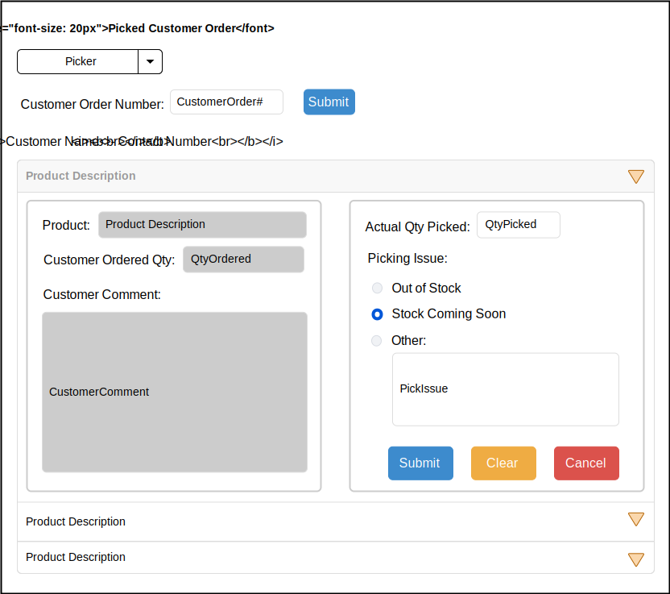
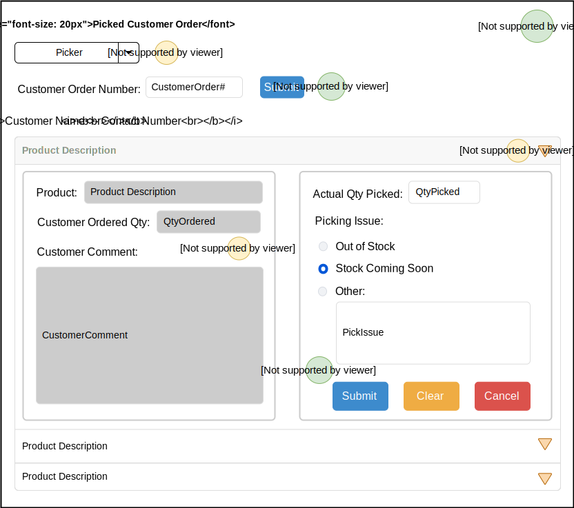

# Picked Customer Order
> This page shows a customer's order and lets the clerk enter picking list information provided by the picker and their submitted picking sheet.

## User Interface
---
> Clerks will mainly interact with this page.

## Events and Interactions
---

 -  - **Page_Load** event
    -  - Loads pickers into the dropdown list.
 -  - **CustomerOrderNumber** submit click event
    - Once the clerk submits the customer order number, the system will load the products the customer ordered and their details  

## POCOs/DTOs
---
